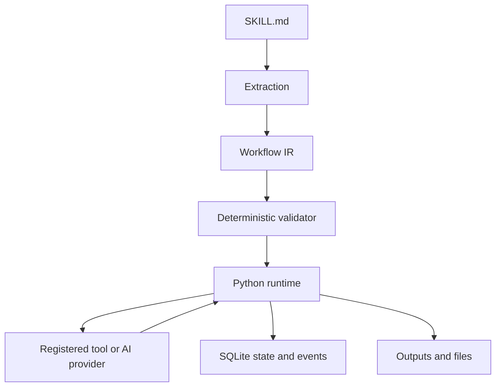

# Architecture

## Goal

ทำให้ขั้นตอนงานใน skill เปลี่ยนเป็นโครงสร้างที่ตรวจสอบและรันซ้ำได้ โดยใช้ AI เฉพาะจุดที่เลือกอย่างชัดเจน ระบบส่วนที่ตัดสินใจว่าจะรัน step ใด ใช้ input ใด และบันทึกสถานะอย่างไรเป็น deterministic control flow

## Compile and execute



1. **Extraction** อ่าน structured IR จาก `workflow-ir` fenced block หนึ่ง block ตามค่าเริ่มต้น
2. **IR** เป็น JSON ที่กำหนด input, steps และ outputs โดยไม่ผูกกับ vendor
3. **Validation** ตรวจ version, schema, step IDs, reference order, condition และ execution limits โดยไม่ execute workflow
4. **Runtime** bind input, resolve reference และรัน step ตามลำดับ พร้อมจัดการ retry, timeout และ state
5. **Result** คืน JSON ให้ caller และเก็บ state/events ใน SQLite ส่วน built-in file tools เขียน artifact ใต้ workspace

`compile_skill(text, extractor=None)` เป็น compile API ค่าเริ่มต้นไม่มี language model และไม่อนุมานงานจาก prose เมื่อไม่มี structured block ที่ถูกต้องจะ fail แทนการเดา workflow

## Semantic extraction extension

`SemanticExtractor` เป็น protocol ที่มี method:

```python
def extract(self, text: str) -> dict:
    ...
```

ผู้พัฒนาสามารถ implement provider ที่แปลงคำอธิบายภาษาธรรมชาติเป็น IR แล้วส่งให้ `compile_skill(text, extractor=provider)` ระบบจะ validate ผล extraction ด้วยกติกาเดียวกับ structured JSON

มี optional `ChatCompletionsProvider` สำหรับ endpoint ที่รองรับ OpenAI-compatible Chat Completions โดย caller ระบุ endpoint, model, optional API key และ timeout Constructor ไม่เรียกเครือข่าย; `.extract(text)` จะส่ง request เพื่อสร้าง IR ส่วนการใช้ object เป็น callable ใน AI registry จะส่ง `args.text` ให้ provider แล้วคืน `{"text": ...}` และกำหนด optional `args.instruction` เป็น system instruction ของ task ได้ ตัวอย่างใช้ instruction ให้สรุปเอกสารเป็นสองประโยค

Provider รับ response ที่เป็น JSON ตรง ๆ หรือ fenced JSON เดียวสำหรับ semantic extraction ใช้ system instructions เพื่อขอ IR และไม่บังคับให้ endpoint รองรับ `response_format` ผลลัพธ์ต้องผ่าน validator เสมอ ไม่มี provider retry ภายใน; AI task ใช้ retry ของ runtime ได้ Endpoint ต้องเป็น HTTP(S) URL เต็มที่ไม่มี URL credentials หรือ fragment และ HTTP redirects ถูกปฏิเสธ

Provider boundary มี mocked HTTP tests แต่ยังไม่ได้ทดสอบกับบริการ AI จริง จึงยังไม่รับรองความเข้ากันได้ของ endpoint/model ใดเป็นรายตัว MVP ไม่มี semantic optimizer หรือ workflow repair loop การ compile ที่ผ่าน validator รับรองโครงสร้างที่รองรับเท่านั้น ไม่ได้พิสูจน์ว่าโมเดลเข้าใจเจตนาของผู้เขียนถูกต้องหรือว่า external action จะสำเร็จ

## IR model

| Field | Meaning |
| --- | --- |
| `ir_version` | Version ของ IR ใน MVP คือ `0.1` |
| `id` | Workflow identifier |
| `inputs` | Named inputs พร้อม type และ optional default |
| `steps` | Ordered sequence ของ tool/AI tasks |
| `outputs` | JSON literal หรือ reference ที่ resolve หลัง workflow จบ |

Step มี `id`, `kind`, `tool`, `args` และ optional `when`, `retry`, `timeout_seconds` ชนิด `ai` ใช้ registry ของ AI provider แยกจาก tool ปกติ ทำให้ workflow ระบุการใช้ AI ได้ชัดเจน รองรับไม่เกิน 1,000 steps, `max_attempts` 1–10, `delay_seconds` 0–3,600 และ `timeout_seconds` มากกว่า 0 ถึง 3,600

Input รองรับ `string`, `number`, `integer`, `boolean`, `object`, `array` และไม่รับ input ที่ไม่ได้ประกาศไว้ ข้อมูลต้องเป็น JSON จริง ไม่ใช้ `NaN` หรือ `Infinity`

Reference เขียนเป็น object ที่มี `$ref` เพียง key เดียว เช่น:

```json
{"$ref": "inputs.input_path"}
```

```json
{"$ref": "steps.read_input.text"}
```

อ้าง step ได้เฉพาะขั้นก่อนหน้าและอ่าน nested dict fields ได้ ไม่มี forward reference, mutation, expression interpolation หรือ `eval` ค่า input กับ named step outputs เป็นตัวแปรแบบ immutable และใช้ `core.value` เป็นจุดตั้งชื่อค่าเพิ่มเติมได้

`when` เป็น condition ที่ runtime ประเมินก่อน execution ใน MVP รองรับ `equals` ซึ่งรับ operand สองค่า เช่น boolean input เทียบกับ literal `true` ขั้นที่ถูกข้าม resolve เป็น `None` เมื่อถูกอ้างอิง ดังนั้น pipeline ต้องไม่ใช้ผลจาก conditional step เป็น input บังคับของขั้นถัดไป ตัวอย่างจึงเขียนผลจาก normalize โดยตรง และเก็บ AI summary เป็นผลเสริมของ step เท่านั้น

## Runtime responsibilities

| Concern | MVP behavior |
| --- | --- |
| Sequence | รัน step ทีละตัวตามลำดับ |
| Tools | เรียก callable ที่ลงทะเบียนด้วยชื่อ ห้าม IR import code เอง |
| AI | เรียกเฉพาะ explicit AI task และ provider callable ที่ลงทะเบียน; มี optional Chat Completions provider |
| Retry | กำหนด `max_attempts` และ `delay_seconds`; budget ใหม่เมื่อ resume |
| Timeout | แยก task เป็น subprocess เพื่อหยุด task เมื่อ timeout |
| State | SQLite เก็บ workflow identity, inputs, workspace, run/step state และ events |
| Resume | ใช้ผลสำเร็จหรือสถานะ skip ที่บันทึกไว้ และเริ่มต่อจากส่วนที่ยังไม่สำเร็จ |
| Concurrency | Per-run POSIX file lock ป้องกัน executor บนเครื่องเดียวกันรัน run เดียวกันซ้อน |

`TaskContext` ให้ `workspace`, `run_id`, `step_id`, `idempotency_key` แก่ tool Stable idempotency key ช่วยให้ tool ส่งต่อการ deduplicate ให้ external service ที่รองรับได้ แต่ runtime ไม่รับรอง exactly-once side effects

## Crash recovery

Normal retry ใช้กับ failure ที่ runtime รู้ผลแล้ว หาก process ล่มระหว่าง step กำลังทำงาน สถานะ `running` ที่ค้างอยู่บอกไม่ได้ว่า external side effect เกิดขึ้นแล้วหรือยัง Runtime จึงต้องการ explicit recovery ก่อน resume:

```python
runtime.recover(run_id, policy="retry")
```

หรือ CLI `recover RUN_ID --db PATH --retry-interrupted` ผู้เรียกต้องตรวจผลที่อาจเกิดขึ้นก่อน retry การ recover ไม่ undo งานเดิม และการ timeout ไม่ถอนคำขอที่ถูกส่งไปยังระบบอื่นแล้ว

Resume ใช้ workflow, normalized inputs และ workspace เดิม ถ้าแก้ workflow หรืออยากอ่าน input file เวอร์ชันใหม่ ให้เริ่ม run ใหม่ การ reuse ผลจาก SQLite ไม่ได้ตรวจ content change ของไฟล์ภายนอกให้อัตโนมัติ และ identity ยังไม่ pin source version ของ custom tool/provider ผู้เรียกต้องรักษา implementation ที่ใช้ resume เอง

## Tool boundary

Built-in tools:

| Tool | Output |
| --- | --- |
| `files.exists` | `exists`, `path` |
| `files.require_exists` | `exists`, `path`; fail เมื่อไม่พบไฟล์ |
| `files.read_text` | `text` |
| `text.normalize` | `text`: trim แต่ละบรรทัด ตัดบรรทัดว่างหัวท้าย และ normalize line ending เป็น LF |
| `files.write_text` | `path`, `bytes` |
| `core.value` | `value` |

File tools จำกัด path ใต้ workspace ปฏิเสธ `..` path components และ symlink ทั้งหมดใน user path ใช้ POSIX descriptor operations เพื่อป้องกันการเปลี่ยน path ระหว่างตรวจและเปิดไฟล์ ผลลัพธ์ `path` เป็น workspace-relative path เสมอ built-in text I/O ใช้ UTF-8 และ file writes เป็น atomic replacement พร้อมสร้าง parent directories ที่ยังไม่มี

`text.normalize` คง whitespace ภายในบรรทัดไว้และไม่เติม final newline ส่วน `files.exists`/`files.require_exists` ตรวจการมีอยู่ของทั้งไฟล์และ directory การพยายามอ่าน directory เป็นข้อความจะ fail ที่ `files.read_text`

Custom callable เป็น trusted code และไม่ถูกจำกัดสิทธิ์ระบบโดย IR validator การแยก subprocess มีไว้ควบคุม timeout ไม่ใช่ security sandbox หรือการแยก tenant

Tool ต้องคืนผลแบบ synchronous และไม่ทิ้ง background subprocess ให้ทำงานต่อหลัง return เพราะ runtime ปิด process group เมื่อ step จบทั้งกรณีสำเร็จและล้มเหลว

## Backend neutrality

`BackendAdapter` และ capability declarations กำหนดจุดเชื่อมต่อสำหรับ backend compiler ในอนาคต ยังไม่มี remote adapter implementation ใน MVP

ก่อนรองรับ backend ใหม่ ต้องกำหนด mapping ของ condition, retry, timeout, idempotency, persistence และ resume ให้ชัดเจน Adapter ต้องปฏิเสธ feature ที่รองรับไม่ครบ ห้ามลดความหมายของ workflow โดยเงียบ ๆ เป้าหมายในอนาคตรวม Temporal, n8n, GitHub Actions, LangGraph และ Azure Durable Functions โดยยังไม่สรุปว่าจะใช้ backend ใดเป็นตัวแรก

## Explicit exclusions

MVP ไม่มี loops, parallel nodes, distributed scheduling, remote workers, UI, RPA, human approval engine หรือ deployment service การใช้ Codespaces เป็นการรัน Python runtime บน development machine ใน cloud เท่านั้น
