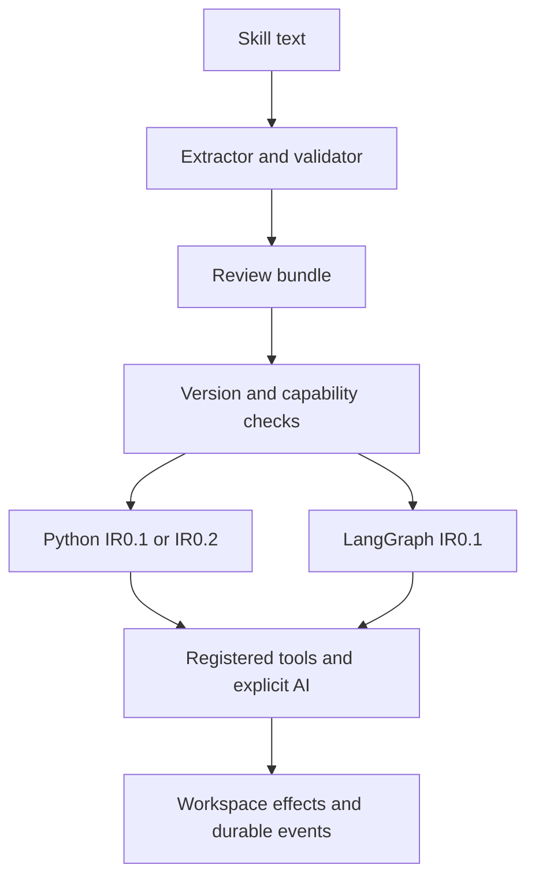
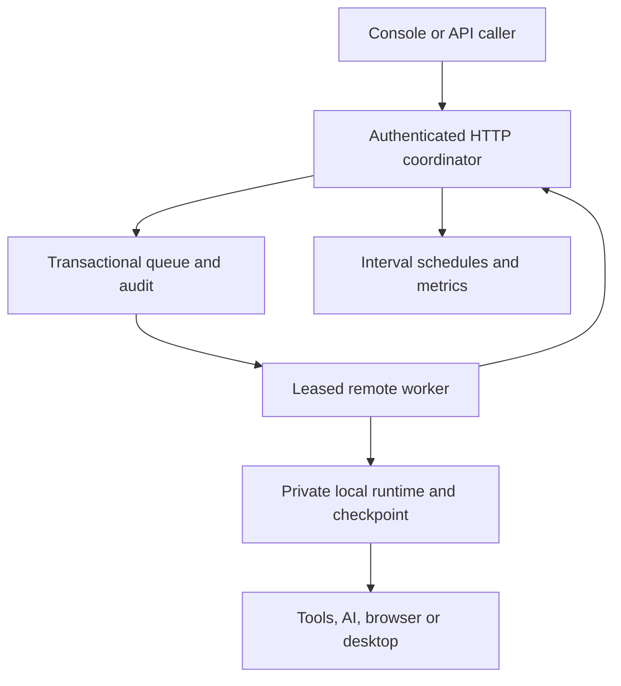

# Architecture

The system separates interpretation, validation, review, execution and effects.
A model can propose a workflow; the model never controls the runtime directly.

Structured extraction requires exactly one `workflow-ir` fenced JSON block.
Semantic extraction uses an explicitly configured Chat Completions endpoint and
an accept/reject envelope. Its output passes the same deterministic validator.
Version0.2 CLI semantic compilation always returns a pending review bundle;
legacy `compile_skill` remains the IR0.1 extraction API for trusted Python callers.

The bundle retains source, workflow, diagnostics and sanitized provenance. Hashes
bind a review acknowledgement to that exact content. This catches edits after
review but is not a cryptographic identity signature. An optimizer only folds
constant equality conditions without executing, reordering or deleting tasks.
See [semantic compilation](semantic-compilation.md).

## IR and backend boundaries

| Concern | IR0.1 | IR0.2 |
| --- | --- | --- |
| Top-level fields | `ir_version`, `id`, `inputs`, `steps`, `outputs` | Same fields, explicit version change |
| Leaf tasks | Registered `tool` and explicit `ai` | Same semantics |
| References | Inputs and prior immutable step results | Adds scoped prior results, loop item/index and list indexes |
| Conditions | Two-operand typed JSON `equals` | Same rule, also available on structured nodes |
| Retry/timeout | Bounded leaf attempts/delay/time | Same leaf behavior |
| Control flow | Sequential steps | Bounded foreach, named parallel branches, approval checkpoints |
| Executors | Python Runtime, LangGraphRuntime | AdvancedRuntime |

Input types are JSON string/number/integer/boolean/object/array, with optional
defaults. Unknown input names, invalid reference order, nonfinite numbers,
unsupported fields and excessive nesting are rejected. There is no eval, shell
expression or code import in the IR. Skipped results are null; workflows must not
require a skipped value as a file path or another mandatory argument.

`dispatch.validate_any`, `make_runtime` and record inspection select the declared
version. `migrate_v1` explicitly changes validated IR0.1 to compatible IR0.2.
LangGraph uses native StateGraph nodes and generates an executable source artifact;
its capability mapping rejects IR0.2. See [backend mapping](backends.md) and
[advanced execution](advanced-execution.md).

## Durable local execution

The reference runtime uses one task process at a time. The advanced runtime uses
spawned task processes and bounded asynchronous orchestration; LangGraph also uses
spawned leaves. Locally trusted callables are serialized with cloudpickle. Remote
requests and workflows remain JSON and cannot provide a pickle payload.

Runtime state retains workflow, normalized inputs, workspace, attempts, outputs,
errors, stable idempotency keys and append-only events. Resuming must preserve
workflow identity. Successful/skipped leaves are reused; a failed leaf gets a new
bounded retry budget. Approval pauses persist exact step paths and actor decisions.
Parallel branches retain individually completed checkpoints when a sibling pauses
or fails. Cancellation stops active local processes and is persisted.

Executor/effect locks prevent concurrent ownership and prevent recovery while
surviving child tools can still act after a parent crash. Recovery of an uncertain
run requires explicit acknowledgement. Locks assume local POSIX filesystem
semantics; do not place local runtime databases on shared cloud object storage.

## Remote execution and operations

One coordinator owns its SQLite database. Workers never open the coordinator's
file; they claim jobs and renew leases over HTTP. State mutations require the
current lease token, authenticated worker identity and an unexpired deadline.
Unknown effects after lease loss default to `needs_recovery`, not automatic replay.
Explicit `replay_safe` is a caller acknowledgement of safe repeat effects.

A waiting approval is pinned to the worker holding the durable local checkpoint.
Approval uses the authenticated approver's actor, not a request-provided name.
Recovery can release worker affinity after effect reconciliation. See
[distributed execution](distributed-execution.md) for precise recovery semantics.

Roles separate reading, submission/cancellation/recovery, approval, administration
and execution. The same-origin console keeps a token in page memory. Interval
schedules have durable due times and transactional occurrence IDs; they do not
claim cron/timezone/calendar semantics. Protected Prometheus metrics and run events
support operational monitoring. See [operations](operations.md) for Compose,
health checks, backups and production prerequisites.

## Tool and trust boundary

| Built-in | Result |
| --- | --- |
| `files.exists`, `files.require_exists` | `exists`, workspace-relative `path` |
| `files.read_text` | UTF-8 `text` |
| `files.write_text` | Relative `path`, UTF-8 `bytes` |
| `text.normalize` | Trimmed lines, LF line endings, preserved internal whitespace |
| `core.value` | Named immutable `value` |

File tools use POSIX descriptor operations, reject symlinks and `..`, and write
atomically under the workspace. Registered Python plugins are trusted code, not
restricted tenants. They receive `TaskContext(workspace, run_id, step_id,
idempotency_key)` and must return a JSON object synchronously. No background
process should remain after a leaf returns.

Browser tools use Playwright with exact origin policy, navigation/redirect checks
and confined screenshot/download artifacts. Desktop tools use an explicit X11
session, xdotool and Pillow. They remain worker plugins, outside compilation.
See [tool plugins](tool-plugins.md).

Timeouts, cancellation and leases cannot undo external effects already accepted
by another system. Stable idempotency keys help only if that system uses them.
There is no exactly-once claim. Do not store secrets in workflow inputs/outputs;
provider credentials belong in worker environment/configuration. Current resume
identity does not automatically pin arbitrary external file content or custom
implementation versions; plugin source pins and deployment image versions help
operators preserve those identities.

## Evidence and open deployment gates

[SIT](sit-plan.md) exercises real processes, files and HTTP, with required browser,
desktop and container CI gates. Live model evaluation and production cloud rollout
need explicitly configured external environments. See the [roadmap](roadmap.md)
and [validation record](validation.md); code coverage does not by itself certify
an external model, customer application or production infrastructure.
